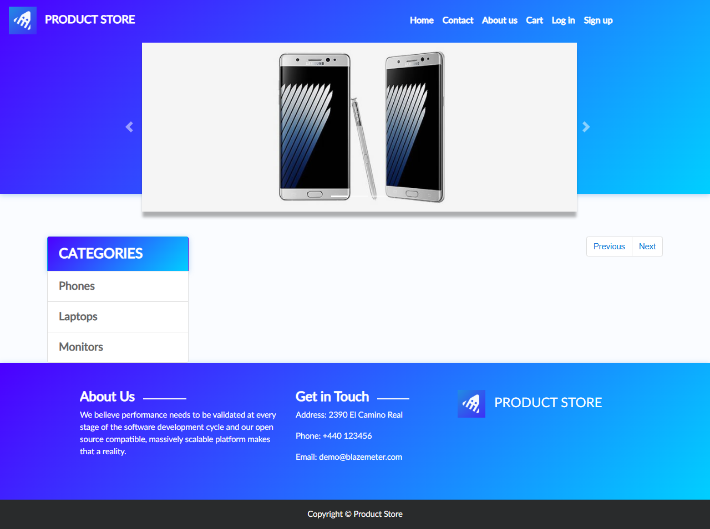
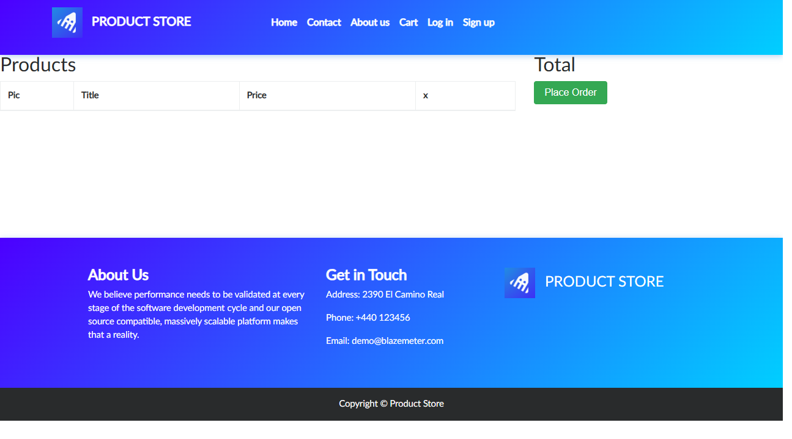
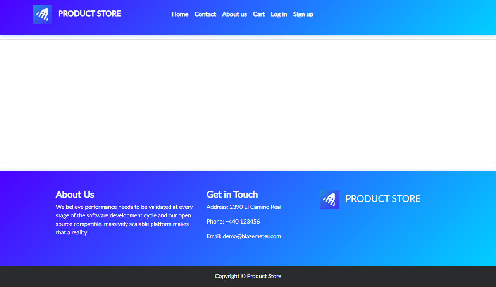

# Proyecto de pruebas automatizadas con Playwright

## Datos

- **Nombre:** JOSE DANIEL BRAN
- **Carné:** 1790-22-15044
- **Curso:** Aseguramiento de la Calidad del Software
- **Universidad:** Universidad Mariano Gálvez de Guatemala
- **Versión de Node.js:** v22.17.0

## Descripción del proyecto

En este proyecto se implementaron pruebas automatizadas utilizando Playwright
con TypeScript como parte del curso de Aseguramiento de la Calidad del Software.

Durante las diferentes clases se trabajó inicialmente con la aplicación
DemoBlaze y posteriormente con Sauce Demo, aplicando conceptos como navegación,
estrategias de espera, capturas de pantalla, locators, acciones de usuario,
assertions, técnicas de diseño de pruebas y el patrón Page Object Model (POM).

El objetivo del proyecto es aplicar progresivamente diferentes técnicas de
aseguramiento de calidad mediante pruebas automatizadas y mantener una
estructura organizada y reutilizable.

## Configuración utilizada

Para desarrollar y ejecutar el proyecto se utilizaron las siguientes
herramientas:

- Visual Studio Code
- Node.js v22.17.0
- TypeScript
- Playwright
- Chromium
- Git
- GitHub

---

# Clase 02 - Navegación, estrategias de espera y capturas de pantalla

## Descripción

En esta práctica se trabajó con navegación entre páginas, estrategias de
espera y generación de capturas de pantalla utilizando DemoBlaze.

## Pruebas realizadas

Se configuraron cuatro pruebas automatizadas:

1. Navegar al carrito y regresar a la página de inicio.
2. Navegar a la categoría Phones y abrir el detalle de un producto.
3. Capturar por separado la barra de navegación y el footer.
4. Verificar que la página principal cargue en menos de 10 segundos.

## Resultado de ejecución

Los cuatro tests se ejecutaron correctamente en Chromium.

```text
Running 4 tests using 1 worker

✓ Navegar al carrito y regresar al inicio
✓ Navegar a la categoría Phones y ver un producto
✓ Capturar el navbar y el footer por separado
✓ Verificar tiempo de carga de la página

Tiempo de carga: 834ms

4 passed
```

## Evidencias

Durante las pruebas se generaron cinco capturas de pantalla.

### Página de inicio



### Carrito vacío



### Detalle de producto



### Barra de navegación


### Footer


## Reflexión: auto-wait vs. sleep()

Playwright utiliza auto-wait porque los elementos de una página web no
siempre aparecen o están disponibles inmediatamente. Antes de ejecutar una
acción, Playwright espera automáticamente hasta que el elemento se encuentre
en condiciones adecuadas para recibir la interacción.

En cambio, `sleep()` detiene la prueba durante un tiempo fijo. Si el tiempo
establecido es demasiado corto, la prueba puede fallar porque el elemento
todavía no está disponible. Si el tiempo es demasiado largo, la ejecución
pierde tiempo innecesariamente.

La ventaja del auto-wait es que permite desarrollar pruebas más rápidas,
confiables y estables, ya que Playwright espera solamente el tiempo necesario
para continuar con la siguiente acción.

---

# Clase 03 - Locators en Playwright

## Descripción

En esta práctica se utilizaron diferentes estrategias para localizar elementos
en Playwright sobre la aplicación DemoBlaze.

Se trabajó con:

- Locators por texto.
- Locators CSS.
- Locators por ID.
- Locators por atributo.
- Locators encadenados.
- Negaciones.
- Locator por rol.
- Locator con `filter()`.
- Selector por atributo parcial.

## Pruebas realizadas

Se implementaron seis pruebas base y tres tests reto:

1. Locator por texto para verificar elementos del menú.
2. Locator por CSS para verificar productos.
3. Locator por ID para verificar campos del modal de login.
4. Locator por atributo para verificar la imagen de un producto.
5. Locators encadenados para verificar el precio de un producto.
6. Verificación de un elemento que no existe mediante negación.
7. Locator por rol para verificar el botón Place Order.
8. Locator con `filter()` para encontrar un producto específico.
9. Locator por atributo parcial para verificar las categorías.

## Resultado de ejecución

Se ejecutaron correctamente nueve pruebas automatizadas.

```text
Running 9 tests using 1 worker

9 passed
```

## Caso de prueba

Como parte de la actividad se creó el siguiente caso de prueba:

```text
casos-de-prueba/TC-001.md
```

El caso documenta el proceso de agregar un producto al carrito en DemoBlaze.

---

# Clase 04 - Actions en Playwright

## Descripción

En esta práctica se trabajó con acciones de usuario utilizando Playwright
sobre la aplicación DemoBlaze.

Se realizaron pruebas relacionadas con registro de usuarios, inicio de sesión,
interacción con productos, carrito de compras, formularios y manejo de campos
de texto.

## Pruebas realizadas

Se implementaron cuatro pruebas base y tres tests reto:

1. Registrar un nuevo usuario.
2. Login con el usuario registrado.
3. Flujo completo: login, agregar producto y verificar carrito.
4. Intentar login con credenciales incorrectas.
5. Llenar el formulario Place Order utilizando `fill()`.
6. Cerrar el modal de login utilizando el botón Close.
7. Llenar y limpiar un campo utilizando `clear()`.

## Resultado de ejecución

Los siete tests se ejecutaron correctamente en Chromium.

```text
Running 7 tests using 1 worker

✓ Registrar un nuevo usuario
✓ Login con el usuario registrado
✓ Flujo completo: login -> agregar producto -> verificar carrito
✓ Intentar login con credenciales incorrectas
✓ Reto 1 - Llenar formulario Place Order con fill()
✓ Reto 2 - Cerrar modal de login con Close
✓ Reto 3 - Llenar y limpiar un campo con clear()

7 passed
```

## Reflexión

Como parte de la tarea se creó el archivo:

```text
tareas/tarea-04.md
```

En este archivo se desarrolló una reflexión sobre los principios del testing,
seleccionando el principio relacionado con la importancia de realizar pruebas
tempranas para reducir el tiempo y costo de corregir errores.

---

# Clase 05 - Assertions y técnicas de diseño de pruebas

## Descripción

En la Clase 05 se trabajó con técnicas tradicionales de diseño de pruebas y
assertions de Playwright utilizando la aplicación Sauce Demo.

Se aplicaron:

- Clases de equivalencia.
- Análisis de valores en la frontera.
- Tablas de decisión.
- Expresiones regulares.
- Assertions sobre elementos.
- Estados de elementos.
- Soft assertions.

## Pruebas realizadas

Se implementaron diez tests base:

1. CE válida: login con credenciales correctas.
2. CE inválida: usuario no existe.
3. CE inválida: usuario bloqueado.
4. Valor en frontera: campos vacíos.
5. Verificar que el inventario tenga exactamente 6 productos.
6. Verificar el precio del primer producto mediante expresión regular.
7. Verificar atributos y estados de los elementos del inventario.
8. Verificar múltiples propiedades utilizando soft assertions.
9. Tabla de decisión - Regla 1: usuario logueado con productos.
10. Tabla de decisión - Regla 2: usuario logueado con carrito vacío.

## Tests reto

También se desarrollaron tres tests reto:

11. Ordenamiento de productos utilizando `toHaveValue()`.
12. Verificación del foco del campo de usuario utilizando `toBeFocused()`.
13. Verificación del estilo CSS del botón Add to cart utilizando `toHaveCSS()`.

## Resultado de ejecución

Los trece tests fueron ejecutados correctamente en Chromium.

```text
Running 13 tests using 1 worker

13 passed (17.6s)
```

## Tabla de decisión

Como parte de la práctica se creó:

```text
casos-de-prueba/tabla-decision-checkout.md
```

La tabla de decisión documenta diferentes combinaciones de condiciones del
proceso de checkout de Sauce Demo.

---

# Clase 06 - Page Object Model (POM)

## Descripción

En la Clase 06 se implementó el patrón de diseño Page Object Model (POM)
utilizando Playwright y la aplicación Sauce Demo.

El objetivo fue separar los locators y las acciones correspondientes a cada
página del código de los tests.

Esta organización permite crear pruebas más legibles, reutilizables,
mantenibles y fáciles de modificar cuando cambia la interfaz de la aplicación.

## Estructura Page Object Model

Se creó la carpeta `pages/` con los siguientes Page Objects:

```text
pages/
├── LoginPage.ts
├── InventoryPage.ts
├── CartPage.ts
├── CheckoutPage.ts
└── MenuPage.ts
```

## Page Objects implementados

### LoginPage

`LoginPage.ts` contiene los elementos y acciones relacionados con el inicio
de sesión.

Entre sus responsabilidades se encuentran:

- Campo de usuario.
- Campo de contraseña.
- Botón de login.
- Mensajes de error.
- Navegación a la página.
- Inicio de sesión.

### InventoryPage

`InventoryPage.ts` contiene las acciones relacionadas con el inventario.

Permite:

- Verificar que se cargó el inventario.
- Contar productos.
- Agregar el primer producto.
- Agregar productos por nombre.
- Eliminar productos por nombre.
- Acceder al carrito.
- Ordenar los productos.

También se agregó el método:

```typescript
removeProductByName()
```

como parte del tercer reto de la tarea.

### CartPage

`CartPage.ts` maneja las operaciones correspondientes al carrito.

Permite:

- Contar productos.
- Verificar la cantidad de productos.
- Continuar al proceso de checkout.

### CheckoutPage

`CheckoutPage.ts` fue creado como parte del primer reto.

Permite:

- Ingresar el nombre.
- Ingresar el apellido.
- Ingresar el código postal.
- Continuar con el checkout.
- Finalizar la compra.
- Verificar la confirmación de la compra.

### MenuPage

`MenuPage.ts` fue creado como parte del segundo reto.

Permite:

- Abrir el menú hamburguesa.
- Acceder a la opción Logout.
- Cerrar la sesión.
- Verificar el regreso a la pantalla de login.

## Pruebas realizadas

Se implementaron cinco tests base:

1. Login exitoso con POM.
2. Login fallido con POM.
3. Login, agregar dos productos y verificar el carrito.
4. Verificar que el inventario contiene 6 productos.
5. Ordenar los productos de mayor a menor precio.

## Tests reto

Se implementaron los tres retos solicitados.

### Reto 1 - CheckoutPage

Se creó el nuevo Page Object `CheckoutPage.ts` y se automatizó una compra
completa desde el inicio de sesión hasta la confirmación final.

### Reto 2 - MenuPage

Se creó `MenuPage.ts` para manejar el menú hamburguesa y comprobar el flujo
de cierre de sesión mediante Logout.

### Reto 3 - removeProductByName()

Se agregó el método `removeProductByName()` dentro de `InventoryPage.ts`.

La prueba agrega un producto al carrito, verifica que el badge muestre una
unidad, elimina el producto y posteriormente comprueba que el badge
desaparezca cuando la cantidad llega a cero.

## Resultado de ejecución

Los ocho tests correspondientes a la Clase 06 fueron ejecutados
correctamente en Chromium.

```text
Running 8 tests using 1 worker

✓ Login exitoso con POM
✓ Login fallido con POM
✓ Flujo completo: login -> agregar 2 productos -> verificar carrito
✓ Verificar que el inventario tiene 6 productos
✓ Ordenar productos de mayor a menor precio
✓ Reto 1 - Compra completa utilizando CheckoutPage
✓ Reto 2 - Logout utilizando MenuPage
✓ Reto 3 - Quitar producto y verificar que desaparezca el badge

8 passed (20.1s)
```

## Comando utilizado

```bash
npx playwright test tests/clase06.spec.ts --headed
```

## Resultado de los retos

Los tres retos fueron completados correctamente:

- **Reto 1:** compra completada correctamente utilizando `CheckoutPage`.
- **Reto 2:** logout realizado correctamente utilizando `MenuPage`.
- **Reto 3:** producto eliminado y badge del carrito eliminado correctamente.


